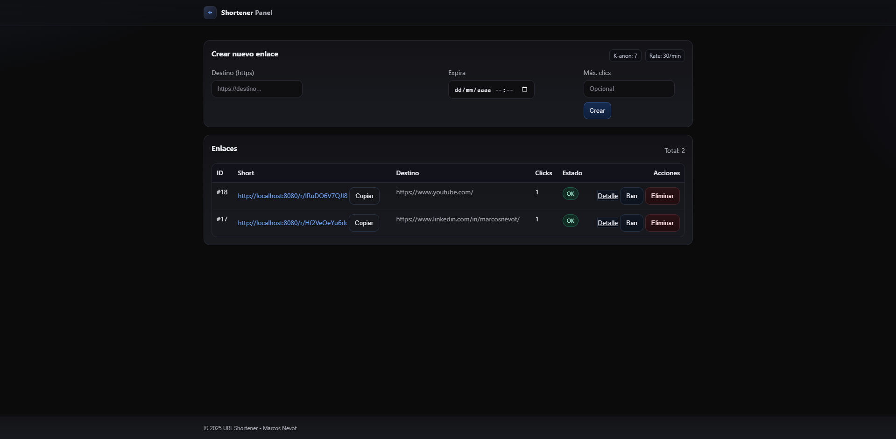
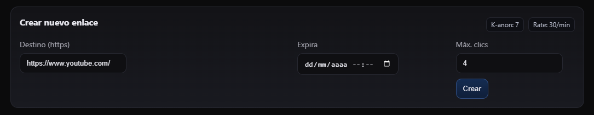
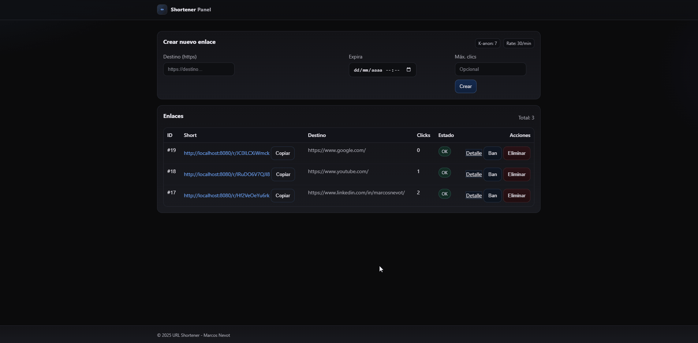
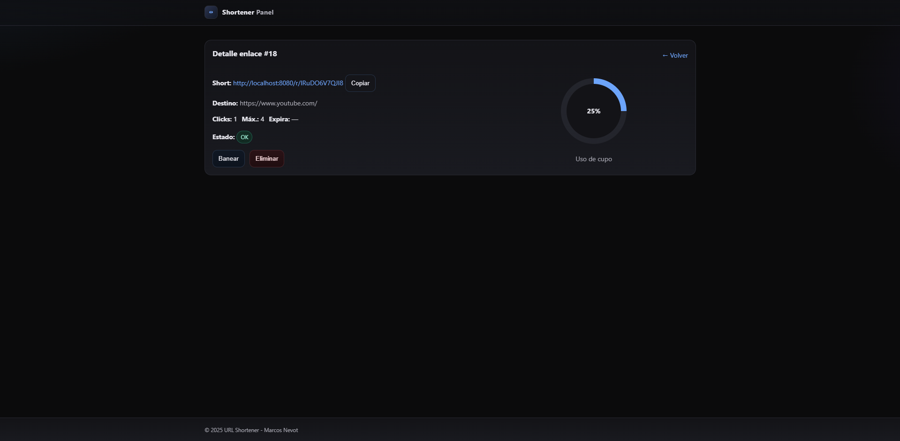
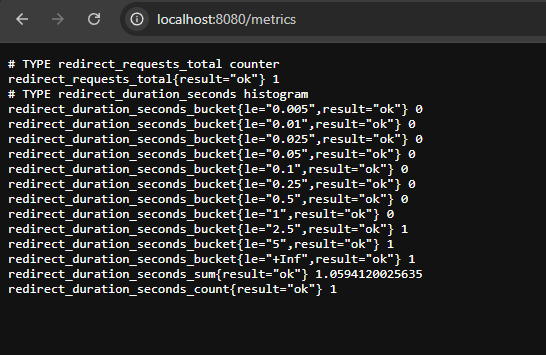
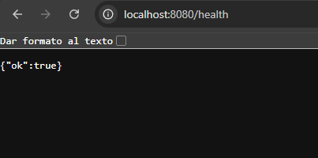

[English](README.md) | **Español**

# Shortener — URL shortener con firmas HMAC y analítica *privacy‑first*


> Laravel 12 + MySQL 8 + Redis 7. Slugs firmados (HMAC), panel mínimo, métricas Prometheus, *rate limits* y estadísticas con *k‑anonymity*.
>
> **Modo portfolio**: no incluye despliegue en producción. Se ejecuta en local con Docker y se valida con CI (tests).

---

## Tabla de contenido
- [Características](#características)
- [Capturas](#capturas)
- [Arquitectura](#arquitectura)
- [Seguridad](#seguridad)
- [Requisitos](#requisitos)
- [Variables de entorno](#variables-de-entorno)
  - [.env (desarrollo)](#env-desarrollo)
  - [.env.testing (CI)](#envtesting-ci)
- [Ejecución local (Docker)](#ejecución-local-docker)
- [Pruebas](#pruebas)
- [API](#api)
- [Observabilidad](#observabilidad)
- [Rate limits](#rate-limits)
- [Colas y analítica](#colas-y-analítica)
- [Estructura del proyecto](#estructura-del-proyecto)
- [CI (GitHub Actions)](#ci-github-actions)
- [Roadmap](#roadmap)
- [Licencia](#licencia)

---

## Características
- ✅ **Slugs firmados (HMAC)**: evita manipulación del slug; verificación en cada resolución.
- ✅ **HEAD‑safe**: las peticiones `HEAD` **no** consumen clic.
- ✅ **Límites de uso**: por creación y resolución (`SHORTENER_MAX_*`).
- ✅ **Lista blanca** de esquemas y dominios permitidos.
- ✅ **Estadísticas *privacy‑first***: agregadas con *k‑anonymity* (no se exponen buckets < *k*).
- ✅ **Métricas Prometheus** (latencias e índices) almacenadas en Redis.
- ✅ **Panel mínimo** con cabeceras de seguridad estrictas.
- ✅ **Pruebas** (PHPUnit) cubriendo slug/HMAC, redirect, headers y API básica.
- ✅ **Docker** multi‑stage (sin Composer en *runtime*).
- ✅ **CI**: GitHub Actions (tests; build & push de imagen opcional si hay secretos).

---

## Capturas

**Panel**


**Crear enlace**


**Redirección (302)**
<p align="center">
  
</p>

**Detalles del enlace**


**/metrics (Prometheus)**


**/health**


---

## Arquitectura
- **App**: Laravel 12 (PHP 8.3 FPM).
- **DB**: MySQL 8 (persistencia de enlaces y tokens).
- **Cache/Colas/Metrics**: Redis 7.
- **Jobs**: `IngestClickEvent` (clasifica y agrega analítica).
- **Métricas**: `App\Services\MetricsContract` → `Metrics` (Redis).
- **SlugService**: `base62(id)` + `_` + `sig(11)`; `sig = HMAC(id|url)`.
- **Endpoints**:
  - Web: `/r/{slug}` (GET/HEAD), `/`
  - API: creación/consulta/baneo/borrado; estadísticas agregadas.

> Ver más detalles en **OBSERVABILITY.md**.

---

## Seguridad
- **HMAC**: clave `SHORTENER_HMAC_KEY` (32 bytes base64) para firmar/verificar slugs.
- **Política *deny‑by‑default*** para URLs: esquemas permitidos (`SHORTENER_ALLOWED_SCHEMES`) y *whitelist* de dominio (`SHORTENER_DOMAIN_WHITELIST`).
- **Cabeceras**: CSP, HSTS, Referrer‑Policy, etc. vía `SecurityHeaders` middleware.
- **Anti‑enumeración**: 404 indistinguible en casos `bad_slug`, `bad_sig`, `banned`, `expired`, `limit_reached`, `not_found`.
- **Tokens API**: tabla `api_tokens` (hash SHA‑256 + `scopes`).

---

## Requisitos
- Docker 24+ y Docker Compose v2.
- (Opcional) PHP 8.3 + Composer 2 si prefieres ejecutar sin Docker.
- Cuenta de Docker Hub **no requerida** en modo portfolio (solo local).

---

## Variables de entorno

### `.env` (desarrollo)
Ejemplo mínimo (ajusta valores si los tuyos difieren):

```env
APP_ENV=local
APP_DEBUG=true
APP_URL=http://localhost:8080
APP_KEY=base64:...             # genera con: php artisan key:generate --show

DB_CONNECTION=mysql
DB_HOST=db
DB_PORT=3306
DB_DATABASE=shortener
DB_USERNAME=shorty
DB_PASSWORD=secret

REDIS_CLIENT=phpredis
REDIS_HOST=redis
REDIS_PORT=6379

QUEUE_CONNECTION=redis
CACHE_STORE=redis
SESSION_DRIVER=database

SHORTENER_HMAC_KEY=base64:XXXXXXXXXXXXXXXXXXXXXXXXXXXXXXXXXXXXXXXXXXX=
SHORTENER_K_ANON=7
SHORTENER_MAX_CREATE_PER_MINUTE=30
SHORTENER_MAX_RESOLVE_PER_MINUTE=120
SHORTENER_ALLOWED_SCHEMES=https
SHORTENER_DOMAIN_WHITELIST=

GEOIP_DB=/var/www/html/storage/app/geoip/GeoLite2-Country.mmdb
```

> **Nota**: `SHORTENER_HMAC_KEY` debe ser una clave segura de 32 bytes en base64.

### `.env.testing` (CI)
Usado por PHPUnit en GitHub Actions (evita problemas de *view cache* y `APP_KEY`):

```env
APP_ENV=testing
APP_KEY=base64:testingappkeymustexist++++++++++++++==
APP_DEBUG=false
APP_URL=http://localhost

DB_CONNECTION=sqlite
DB_DATABASE=:memory:

CACHE_DRIVER=array
SESSION_DRIVER=array
QUEUE_CONNECTION=sync
VIEW_COMPILED_PATH=/tmp
FILESYSTEM_DISK=local

SHORTENER_HMAC_KEY=base64:testingkeyforhmac++++++++++++/w==
SHORTENER_K_ANON=7
SHORTENER_MAX_CREATE_PER_MINUTE=9999
SHORTENER_MAX_RESOLVE_PER_MINUTE=9999
SHORTENER_ALLOWED_SCHEMES=https
SHORTENER_DOMAIN_WHITELIST=
```

---

## Ejecución local (Docker)

Desde la raíz del repo:

```bash
docker compose up -d --build
docker compose exec app php artisan migrate
docker compose exec app php artisan storage:link
```

- App: <http://localhost:8080>  
- Panel: `/`  
- Métricas: `/metrics` (texto Prometheus)  
- Salud: `/health`

**Reiniciar stack / logs**

```bash
docker compose restart
docker compose logs -f --tail=200
```

**Opcional: worker de analítica (en primer plano)**

```bash
docker compose exec app php artisan queue:work --queue=analytics --sleep=1
```

---

## Pruebas

```bash
docker compose exec app ./vendor/bin/phpunit -d memory_limit=512M
```

> En CI se prepara automáticamente un `.env.testing` y rutas temporales de compilación de vistas.

---

## API

**Autenticación**: header `X-Api-Token: <token>` (hash verificado en backend).

### Crear enlace
`POST /api/links`
```json
{
  "url": "https://example.com/page",
  "max_clicks": 100,
  "expires_at": "2026-01-01T00:00:00Z"
}
```
**201**:
```json
{
  "id": 123,
  "slug": "1ZAbcDeF_9dQwE",
  "url": "https://example.com/page"
}
```

### Mostrar enlace
`GET /api/links/{id}` → **200** con datos del enlace | **404** si no existe.

### Borrar enlace
`DELETE /api/links/{id}` → **204** | **404**.

### Banear enlace
`POST /api/links/{id}/ban` → **204** | **404**.

### Stats (agregadas, *privacy‑first*)
`GET /api/stats/{slug}`  
Devuelve agregados que cumplan `k ≥ SHORTENER_K_ANON`.

> Especificación completa en `docs/API/openapi.yaml` (OpenAPI 3.0).

---

## Observabilidad

- **/metrics** (Prometheus):
  - `redirect_requests_total{result=...}`
  - `redirect_duration_seconds_bucket/sum/count`
- **/health**: *liveness/readiness* simple (DB/Redis opcionalmente ping).
- **Logs**: canal `stack` y nivel configurable (`LOG_LEVEL`).

> Detalle ampliado en **OBSERVABILITY.md**.

---

## Rate limits
- **Creación**: `SHORTENER_MAX_CREATE_PER_MINUTE` por token/IP.
- **Resolución**: `SHORTENER_MAX_RESOLVE_PER_MINUTE` por IP.
- Implementado con *named limiters* de Laravel; respuestas **429** con `Retry‑After`.

---

## Colas y analítica
- Los clics (solo en `GET`) encolan `IngestClickEvent` → cola `analytics`.
- En local, puedes lanzar `queue:work` manualmente (ver sección de ejecución).

---

## Estructura del proyecto

```
.
├─ app/                      # Código Laravel + Dockerfile de la imagen
│  └─ Dockerfile
├─ docs/
│  ├─ API/
│  │  └─ openapi.yaml        # Especificación OpenAPI 3.0
│  ├─ ENV.md
│  ├─ OBSERVABILITY.md
│  ├─ OPERATIONS.md
│  └─ SECURITY.md
├─ .github/
│  └─ workflows/
│     └─ ci.yml              # CI: tests + (push imagen si hay secrets)
├─ docker-compose.yml        # Stack local (app, db, redis…)
├─ .gitignore
├─ LICENSE
├─ README.md
├─ CONTRIBUTING.md
└─ CHANGELOG.md
```

> La carpeta `deploy/` y **DEPLOYMENT.md** se han retirado en modo portfolio.

---

## CI (GitHub Actions)

- **tests**: instala dependencias y ejecuta PHPUnit con `.env.testing`.
- **build & push (opcional)**: si configuras secretos de Docker Hub (`DOCKERHUB_USERNAME`, `DOCKERHUB_TOKEN`), construye la imagen con `./app/Dockerfile` y la publica.

Puedes desactivar la parte de *push* eliminando el job de build o dejando sin definir los secretos.

---

## Roadmap
- [ ] Panel de estadísticas (agregadas, *k‑anon*).
- [ ] Publicación del OpenAPI como documentación estática.
- [ ] Integración con Pushgateway (opcional) para *batch jobs*.
- [ ] Canary para worker de analítica.

---

## Licencia
MIT
